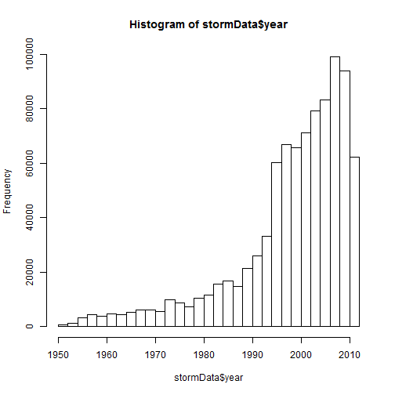
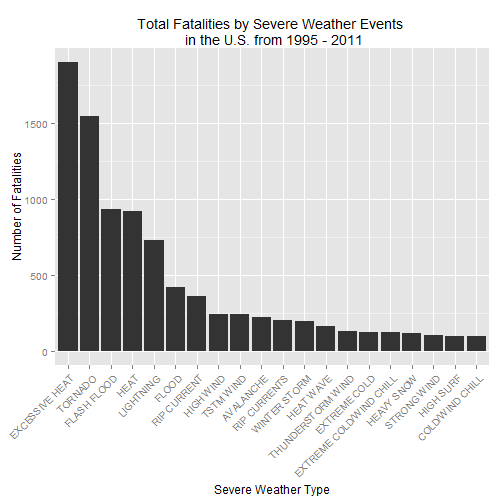
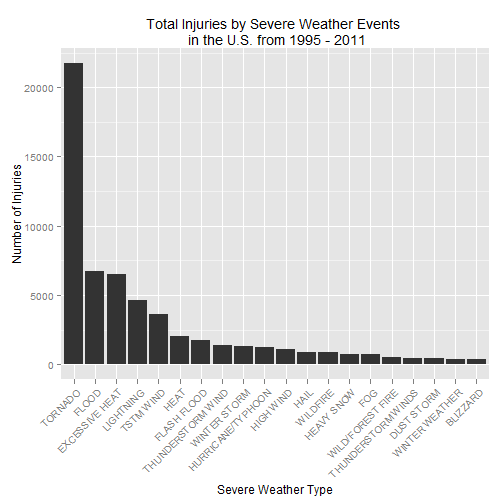
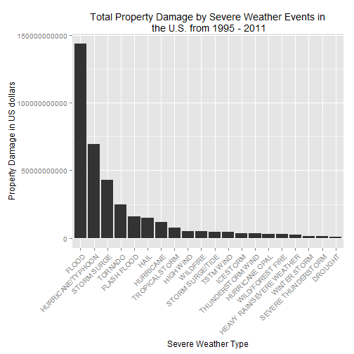
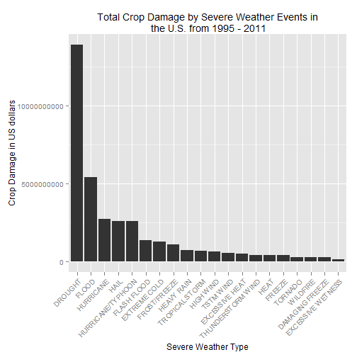

# Reproducible Research: Peer Assessment 2
------------------------------------------


## Impact of Severe Weather Events on Public Health and Economy in the United States 
 
### Synonpsis
In this report, we try to analyze the impact of different weather events that have a greater impact on public health and economy based on the storm database collected from the U.S. National Oceanic and Atmospheric Administration's (NOAA) from 1950 - 2011.This database tracks characteristics of major storms and weather events in the United States, including when and where they occur, as well as estimates of any fatalities, injuries, and property damage. From these data, we found that excessive heat and tornado are most harmful with respect to population health, while flood, drought, and hurricane/typhoon have the greatest economic consequences. 
 
## Visible settings  

```r
echo = TRUE 
options(scipen = 1) 
```

## Loading libraries

```r
library(R.utils) 
library(ggplot2) 
library(plyr) 
library(gridExtra) 
```

## Processing Data

```r
if (!"repdata_data_StormData.csv.bz2" %in% dir("/dataset/")) 
{ 
     bunzip2("dataset/repdata_data_StormData.csv.bz2", overwrite=T, remove=F) 
} 
```

### Reading Data

```r
stormData <- read.csv("dataset/repdata_data_StormData.csv", sep = ",")
dim(stormData)
```

```
## [1] 902297     37
```

There are 902297 rows and 37 columns total in the database. The events in the database start in the year 1950 and end in November 2011. In the earlier years of the database there are generally fewer events recorded, most likely due to a lack of good records. More recent years should be considered more complete.


```r
if (dim(stormData)[2] == 37) 
{ 
   stormData$year <- as.numeric(format(as.Date(stormData$BGN_DATE, format = "%m/%d/%Y %H:%M:%S"), "%Y")) 
} 
hist(stormData$year, breaks = 30)
```

 

Based on the above histogram, we see that the number of events tracked starts to significantly increase around 1995. So, we use the subset of the data from 1990 to 2011 to get most out of good records. 

```r
storm <- stormData[stormData$year >= 1995, ] 
dim(storm) 
```

```
## [1] 681500     38
```

#### Impact on Public Health

In this section, we check the number of **fatalities** and **injuries** that are caused by top twenty severe weather events. 

```r
sortData <- function(fieldName, top = 20, dataset = stormData) 
  { 
     index <- which(colnames(dataset) == fieldName) 
     field <- aggregate(dataset[, index], by = list(dataset$EVTYPE), FUN = "sum") 
     names(field) <- c("EVTYPE", fieldName)
     field <- arrange(field, field[, 2], decreasing = T)
     field <- head(field, n = top) 
     field <- within(field, EVTYPE <- factor(x = EVTYPE, levels = field$EVTYPE)) 
     return(field) 
  } 

fatalities <- sortData("FATALITIES", dataset = storm)
injuries <- sortData("INJURIES", dataset = storm)
```
#### Impact on Economy 
We will convert the **property damage** and **crop damage** data into comparable numerical forms according to the meaning of units described in the code book. Both `PROPDMGEXP` and `CROPDMGEXP` columns record a multiplier for each observations. 


```r
convertData <- function(dataset = storm, fieldName, newFieldName) 
{ 
     totalLen <- dim(dataset)[2] 
     index <- which(colnames(dataset) == fieldName) 
     dataset[, index] <- as.character(dataset[, index]) 
     logic <- !is.na(toupper(dataset[, index])) 
     dataset[logic & toupper(dataset[, index]) == "B", index] <- "9" 
     dataset[logic & toupper(dataset[, index]) == "M", index] <- "6" 
     dataset[logic & toupper(dataset[, index]) == "K", index] <- "3" 
     dataset[logic & toupper(dataset[, index]) == "H", index] <- "2" 
     dataset[logic & toupper(dataset[, index]) == "", index] <- "0" 
     dataset[, index] <- as.numeric(dataset[, index]) 
     dataset[is.na(dataset[, index]), index] <- 0 
     dataset <- cbind(dataset, dataset[, index - 1] * 10^dataset[, index]) 
     names(dataset)[totalLen + 1] <- newFieldName 
     return(dataset) 
 }  
 
storm <- convertData(storm, "PROPDMGEXP", "propertyDamage") 
```

```
## Warning: NAs introduced by coercion
```

```r
storm <- convertData(storm, "CROPDMGEXP", "cropDamage") 
```

```
## Warning: NAs introduced by coercion
```

```r
options(scipen=999) 
property <- sortData("propertyDamage", dataset = storm) 
crop <- sortData("cropDamage", dataset = storm) 
```

### Results 
As for the impact on public health, we have got two sorted lists of severe weather events below by the number of people badly affected. 

```r
fatalities 
```

```
##                     EVTYPE FATALITIES
## 1           EXCESSIVE HEAT       1903
## 2                  TORNADO       1545
## 3              FLASH FLOOD        934
## 4                     HEAT        924
## 5                LIGHTNING        729
## 6                    FLOOD        423
## 7              RIP CURRENT        360
## 8                HIGH WIND        241
## 9                TSTM WIND        241
## 10               AVALANCHE        223
## 11            RIP CURRENTS        204
## 12            WINTER STORM        195
## 13               HEAT WAVE        161
## 14       THUNDERSTORM WIND        131
## 15            EXTREME COLD        126
## 16 EXTREME COLD/WIND CHILL        125
## 17              HEAVY SNOW        115
## 18             STRONG WIND        103
## 19               HIGH SURF         99
## 20         COLD/WIND CHILL         95
```

```r
injuries 
```

```
##                EVTYPE INJURIES
## 1             TORNADO    21765
## 2               FLOOD     6769
## 3      EXCESSIVE HEAT     6525
## 4           LIGHTNING     4631
## 5           TSTM WIND     3630
## 6                HEAT     2030
## 7         FLASH FLOOD     1734
## 8   THUNDERSTORM WIND     1426
## 9        WINTER STORM     1298
## 10  HURRICANE/TYPHOON     1275
## 11          HIGH WIND     1093
## 12               HAIL      916
## 13           WILDFIRE      911
## 14         HEAVY SNOW      751
## 15                FOG      718
## 16   WILD/FOREST FIRE      545
## 17 THUNDERSTORM WINDS      444
## 18         DUST STORM      420
## 19     WINTER WEATHER      398
## 20           BLIZZARD      385
```

Plotting graphs for total fatalities and total injuries affected by these severe weather events.  

### Fatalities Plot

```r
qplot(EVTYPE, data = fatalities, weight = FATALITIES, geom = "bar", binwidth = 1) +
   scale_y_continuous("Number of Fatalities") +  
   theme(axis.text.x = element_text(angle = 45, hjust = 1)) + 
   xlab("Severe Weather Type") +  
   ggtitle("Total Fatalities by Severe Weather Events \n in the U.S. from 1995 - 2011") 
```

 
### Injuries Plot

```r
qplot(EVTYPE, data = injuries, weight = INJURIES, geom = "bar", binwidth = 1) +  
   scale_y_continuous("Number of Injuries") +  
   theme(axis.text.x = element_text(angle = 45,  
   hjust = 1)) + xlab("Severe Weather Type") +  
   ggtitle("Total Injuries by Severe Weather Events \n in the U.S. from 1995 - 2011") 
```

 

Based on the above histograms, we found that **excessive heat** and **tornado** cause most fatalities; **tornato** causes most injuries in the United States from 1995 to 2011. 
 
As for the impact on economy, we got two sorted lists below by the amount of money cost by damages.
 

```r
property 
```

```
##                       EVTYPE propertyDamage
## 1                      FLOOD   144022037057
## 2          HURRICANE/TYPHOON    69305840000
## 3                STORM SURGE    43193536000
## 4                    TORNADO    24935939545
## 5                FLASH FLOOD    16047794571
## 6                       HAIL    15048722103
## 7                  HURRICANE    11812819010
## 8             TROPICAL STORM     7653335550
## 9                  HIGH WIND     5259785375
## 10                  WILDFIRE     4759064000
## 11          STORM SURGE/TIDE     4641188000
## 12                 TSTM WIND     4482361440
## 13                 ICE STORM     3643555810
## 14         THUNDERSTORM WIND     3399282992
## 15            HURRICANE OPAL     3172846000
## 16          WILD/FOREST FIRE     3001812500
## 17 HEAVY RAIN/SEVERE WEATHER     2500000000
## 18              WINTER STORM     1538047250
## 19       SEVERE THUNDERSTORM     1200310000
## 20                   DROUGHT     1046106000
```

```r
crop 
```

```
##               EVTYPE  cropDamage
## 1            DROUGHT 13922066000
## 2              FLOOD  5422810400
## 3          HURRICANE  2741410000
## 4               HAIL  2614127070
## 5  HURRICANE/TYPHOON  2607872800
## 6        FLASH FLOOD  1343915000
## 7       EXTREME COLD  1292473000
## 8       FROST/FREEZE  1094086000
## 9         HEAVY RAIN   728399800
## 10    TROPICAL STORM   677836000
## 11         HIGH WIND   633561300
## 12         TSTM WIND   553947350
## 13    EXCESSIVE HEAT   492402000
## 14 THUNDERSTORM WIND   414354000
## 15              HEAT   401411500
## 16            FREEZE   396225000
## 17           TORNADO   296595770
## 18          WILDFIRE   295472800
## 19   DAMAGING FREEZE   262100000
## 20 EXCESSIVE WETNESS   142000000
```

Plotting graphs for total property damage and total crop damage affected by these severe weather events.

### Property Plot

```r
qplot(EVTYPE, data = property, weight = propertyDamage, geom = "bar", binwidth = 1) +  
   theme(axis.text.x = element_text(angle = 45, hjust = 1)) + scale_y_continuous("Property Damage in US dollars")+  
   xlab("Severe Weather Type") + ggtitle("Total Property Damage by Severe Weather Events in\n the U.S. from 1995 - 2011") 
```

 

### Crop Plot

```r
qplot(EVTYPE, data = crop, weight = cropDamage, geom = "bar", binwidth = 1) +  
   theme(axis.text.x = element_text(angle = 45, hjust = 1)) + scale_y_continuous("Crop Damage in US dollars") +  
   xlab("Severe Weather Type") + ggtitle("Total Crop Damage by Severe Weather Events in\n the U.S. from 1995 - 2011") 
```

 

Based on the above histograms, we found that **flood** and **hurricane/typhoon** cause most property damage; **drought** and **flood** causes most crop damage in the United States from 1995 to 2011. 
 
### Conclusion   
From these data, we found that **excessive heat** and **tornado** are most harmful with respect to population health, while **flood**, **drought**, and **hurricane/typhoon** have the greatest economic consequences.
